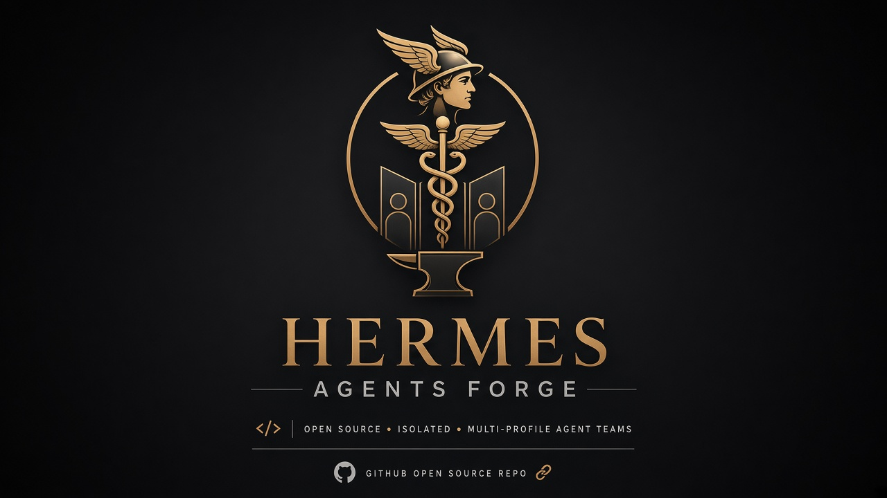

<p align="center">
  
</p>

# Hermes Agents Forge

**Tell Hermes what you want done. Forge turns that goal into a small, named team of agents — each with a clear job — on your machine.**

You do not need to clone this repository. Forge is a skill you install into [Hermes](https://hermes-agent.nousresearch.com). After that, you talk in plain language. Hermes proposes a team, you approve it, and Forge creates the profiles locally.

[Open the site](https://hermes-agents-forge.vercel.app) · [How to start](https://hermes-agents-forge.vercel.app/start.md) · [The skill](https://hermes-agents-forge.vercel.app/SKILL.md)

---

## What this is

Hermes can already chat, use tools, and run skills. What it does not do by default is **staff a team around one product or one outcome**.

Forge fills that gap:

- You describe what you want (a product, a workflow, a business outcome).
- Forge proposes 3, 5, or 7 **profiles** — named roles such as an orchestrator, a researcher, or a writer — each scoped to **one** product.
- You look at the table and say yes, no, or change it.
- Only then does Forge create those profiles on your computer, write each role file (`SOUL.md`), and (if you asked for high autonomy) set up a kanban board so work can loop until it is done.

Think of it as onboarding for a tiny agency that lives in Hermes, not as a cloud product and not as a template dump.

## Who it is for

| You are… | You can use Forge to… |
| --- | --- |
| **Not a developer** | Describe a goal in everyday language. Approve a team. Let Hermes create the roles. You never have to open this GitHub repo. |
| **A builder or founder** | Staff a focused team around one product (marketing, ops, research, support) without inventing the org chart yourself. |
| **A developer** | Inspect this repo, the skill, and the site. Contribute. Do **not** treat `git clone` as the installer. |

Forge works with whatever model you already run in Hermes. Stronger models can finish the whole team in one go after you approve. Smaller models go step by step — one question, then one profile — so the same plan still completes.

## How a session feels

1. **You say the goal.** Example: “Help me launch Meteoracle, not the lyrics app.”
2. **Forge asks a few short questions** (or infers them): your role, time and tools, what “done” looks like. If you name two products, it parks the second one. One team, one product.
3. **You get a table:** profile name, job, skills that actually exist in Hermes, and who hands off to whom.
4. **You approve.** That single yes is the gate. Forge then creates the profiles and writes the role files. It does not ask again whether it should continue.
5. **You get a report:** what was created, where the files live, whether kanban was set up, and anything that failed. Then it stops.

That is the whole product loop. Work on the actual product starts later, in those profiles — not inside the Forge skill.

## Get started

You need [Hermes](https://hermes-agent.nousresearch.com) (Desktop or CLI) already installed.

### Easiest: Desktop

1. Open [hermes-agents-forge.vercel.app](https://hermes-agents-forge.vercel.app).
2. Click **Copy Desktop prompt** and paste it into a Hermes Desktop chat.
3. Hermes writes the skill file locally, then asks: *What do you want Hermes to accomplish for you?*

### Terminal

```bash
mkdir -p "$HOME/.hermes/skills/software-development/forge"
curl -fsSL https://hermes-agents-forge.vercel.app/SKILL.md -o "$HOME/.hermes/skills/software-development/forge/SKILL.md"
```

Then, in Hermes, ask it to follow the Forge skill (you do **not** type `/forge` or `/goal`).

After you merge skill updates, run the same `curl` again so the local file matches the site.

## What you get

- Isolated **Hermes profiles** under `~/.hermes/profiles/` — one folder per role.
- A **SOUL.md** in each profile: role, in-scope product, out-of-scope products, and handoffs.
- Skills taken only from `hermes skills list` (usually builtins). Hermes already copies bundled skills into new profiles; that is normal, not extra installs.
- Optional **kanban** if you asked for high autonomy or “loop until done.” Five chat profiles are not a loop by themselves.
- Keys inherited from your default / shell Hermes setup. Forge never asks you to paste API keys into the chat.

## Guardrails (plain language)

These are product rules, not fine print:

- **Nothing is created until you approve the table.**
- **One product per team.** A second app waits for a later team.
- **No live trading or payment keys in v1.** Forge will not promise zero financial loss.
- **No cloning this repo to “install.”** This GitHub project is source code for the skill and the site.
- **No admin commands.** Everything stays in your Hermes home directory.
- **Third-party skills and external services** are named and approved separately.

## This repository

If you are reading this on GitHub, you are looking at the source for:

- the public skill (`site/public/SKILL.md` and `skills/forge/SKILL.md`)
- the landing page and install helpers (`site/`)
- tests and compiler/runtime experiments

Canonical user path: **site → paste prompt or curl the skill → talk to Hermes.**  
Canonical contributor path: branch, PR, then refresh the local skill with `curl` after merge.

## Links

- Site: [hermes-agents-forge.vercel.app](https://hermes-agents-forge.vercel.app)
- Skill: [SKILL.md](https://hermes-agents-forge.vercel.app/SKILL.md)
- Agent start notes: [start.md](https://hermes-agents-forge.vercel.app/start.md)
- Hermes docs: [hermes-agent.nousresearch.com/docs](https://hermes-agent.nousresearch.com/docs)
